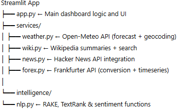

# 🧠 IntelliDash — Intelligent Multi-Source Dashboard

**IntelliDash** is a modern dashboard built with **Streamlit**, integrating multiple open APIs to deliver intelligent, data-driven insights from **weather**, **news**, **Wikipedia**, and **foreign exchange** — all enhanced with light **Natural Language Processing (NLP)**.

---

## Features

### Weather (Open-Meteo)
- Real-time weather by city (temperature °C/°F, wind, UV index, sunrise & sunset).
- Powered by [Open-Meteo API](https://open-meteo.com/).

### Wikipedia
- Searches and summarizes Wikipedia topics.
- Extracts **keywords** (RAKE) and generates **summaries** (TextRank).
- Uses the [Wikipedia REST API](https://www.mediawiki.org/wiki/API:REST_API).

### Tech News (Hacker News)
- Retrieves the latest tech-related stories via [Hacker News Algolia API](https://hn.algolia.com/api).
- Performs a **sentiment score** analysis for each title.

### Currency Exchange (Frankfurter.app)
- Converts between major currencies and shows **historical exchange rates (7 days)**.
- Uses [Frankfurter.app](https://www.frankfurter.app/) — ✅ **no API key required**.

### NLP Intelligence
- Keyword extraction (RAKE)
- Summarization (TextRank)
- Heuristic sentiment analysis

---

## 🧩 Architecture Overview
<p align="center">
  
</p>

---

## How to run it locally? 

### Create and activate a virtual environment
```bash

## How to run it in a Python environment?

1: git clone https://github.com/AlvaroG88/IntelliDash
2: cd IntelliDash
3: python -m venv .venv
4: . .venv/Scripts/Activate.ps1     # On Windows PowerShell
# or
4: source .venv/bin/activate        # On macOS / Linux
### Install dependencies
5: pip install -r requirements.txt

### Run the web application
6: streamlit run app.py
Then open http://localhost:8501 in your browser.

---

## How to run it in a Docker container?
```bash
1: git clone https://github.com/AlvaroG88/IntelliDash
2: cd IntelliDash
3: docker compose up --build

To stop the container:
docker compose down

---


